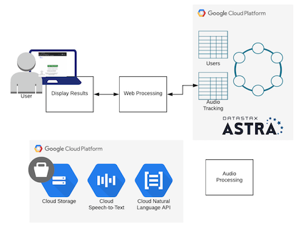
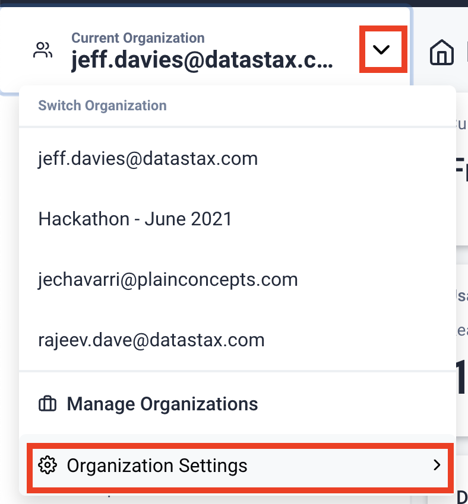
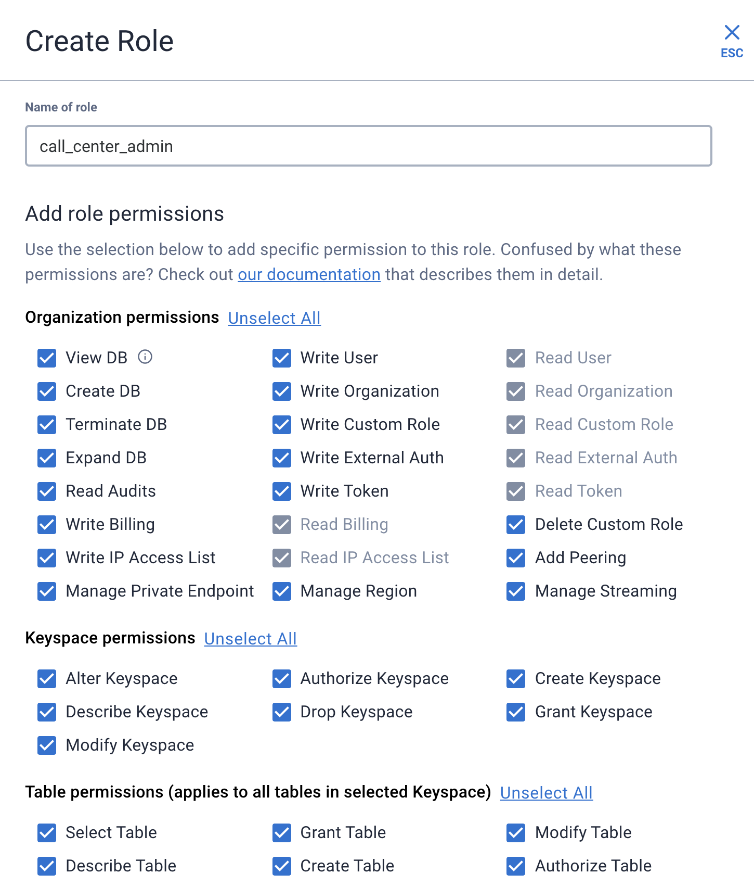
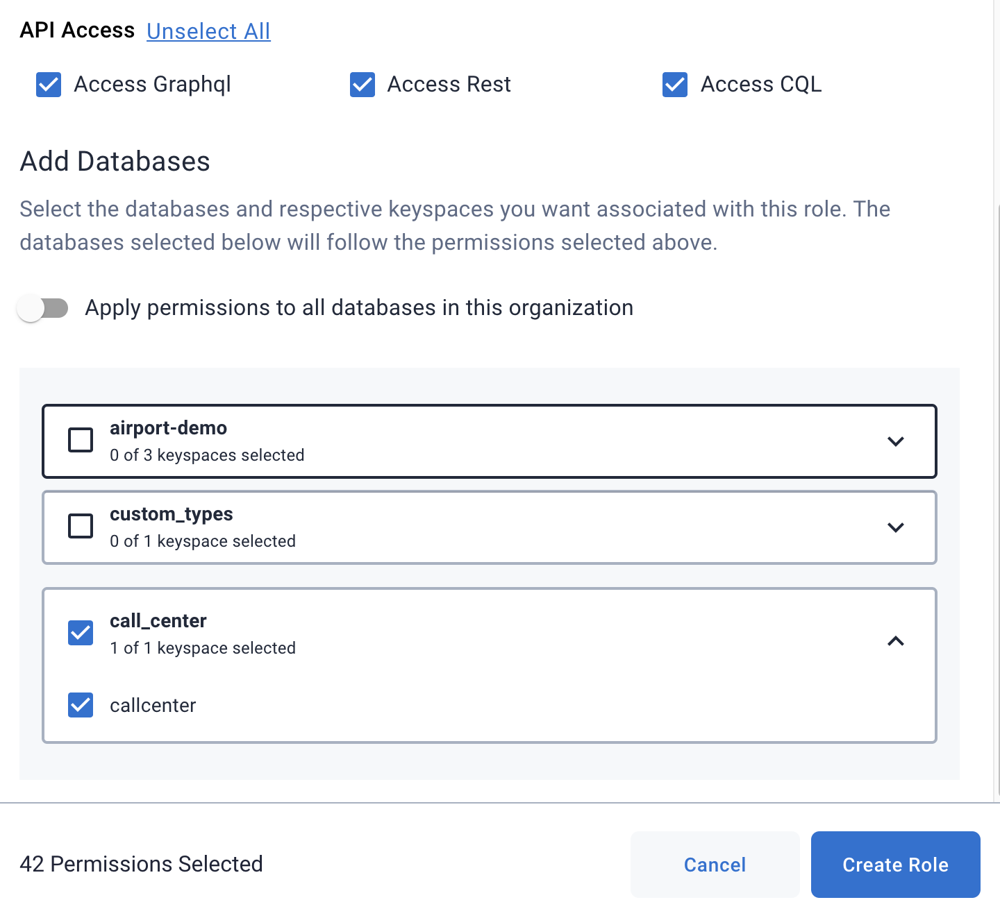
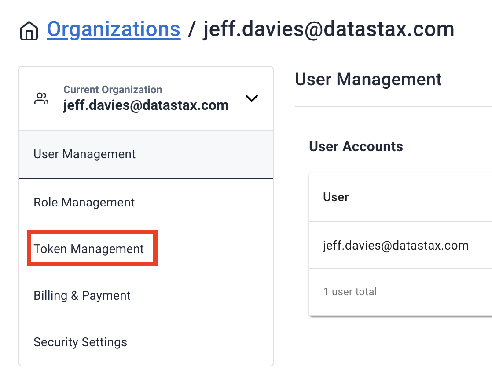
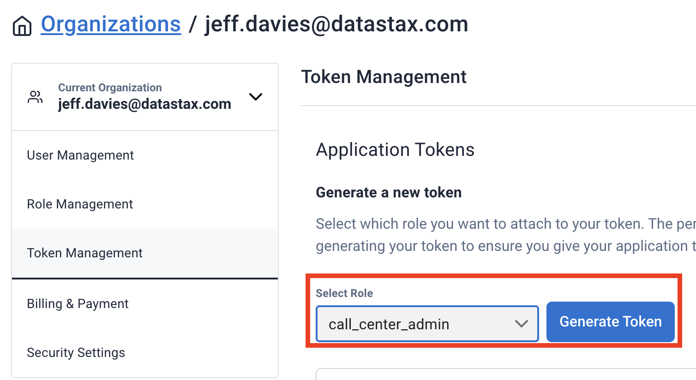
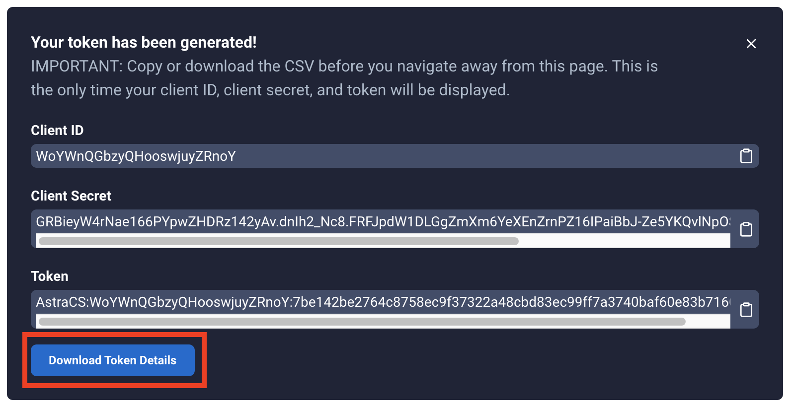

# Intro

This project simulates a call center web site where people leave a message for CSRs
to process later.  It uses Google's services, Netlify, and Astra Database.

## Using the app

The application is up and running at
[https://festive-morse-d7a982.netlify.app/login](https://festive-morse-d7a982.netlify.app/login)

The app works best on Chrome, and you need to give browser permissions for recording and location when prompted (for full effect).

Click login and use one of the following credentials:

- demo1 / demo1PwdIsGood
- demo2 / demo2Pwd

Press Start Recording and then start speaking, and press Stop Recording when finished.  Watch as your call is processed (it will take 1-2 mins).  Once you see status gcp-complete, you can click on the dashboard and click on the map to find your call and transcription.

Video demo located at: [https://youtu.be/33LgrD2yuLs](https://youtu.be/33LgrD2yuLs)

## High Level Architecture



### UI client

The UI client is written in Angular and runs on netlify.  It a) calls an
API server to login the user, upload a recording, get a recording's
status, and present the dashboard, and b) has a **netlify function that
invokes Stargate's Document API** to get a specific user's recordings (at
the moment it is hard coded to all recordings).

Try it out - [https://festive-morse-d7a982.netlify.app/](https://festive-morse-d7a982.netlify.app/)

Login using either:

- demo2 / demo2Pwd
- demo1/demo1PwdIsGood

Calling the netlify function directly - [https://festive-morse-d7a982.netlify.app/.netlify/functions/getAllRecordings](https://festive-morse-d7a982.netlify.app/.netlify/functions/getAllRecordings)

### App Server

@REDO - Today, July 23rd 2021, this server is running on AWS.  It is running https w/ a domain
name that is owned by Rajeev.

#### uploadServer - Audio Processor (API Server)

The uploadServer is the API server that interacts with Astra (keep the Astra credentials a secret).
That is in **Node and uses the Node CQL** driver to make CQL queries.

This code accepts the file from the client, and moves it to GCP's Object Store (keep GCP credentials a secret), and logs the metadata into Astra.

#### Backend Message Processor - Audio Processor

This is a Python Program that polls Astra for new recordings and then interacts GCP's Speech-to-Text and NLP service.  It stores the results into Astra.

This **python program uses REST, Document and CQL APis.**

The current file is /call-center-app-v3/call-audio-processing/read_call_job.py

This python script runs as an infite loop on the AWS server (REDO), sleeping for a configurable amount of time and waking up to check the Astra database for new calls to process.  **This process needs to be rewritten.**

## Installation

You will need the following components

1. Netlify account
1. This github repository
1. Astra DB in cloud provider / region of choice (our demo currently uses Google)
1. AppServer to host uploadserver and audio processor (can be local or on cloud provider, we are currently using an AWS server TOFO: switch to Google)
1. Credentials to a GCP service account, and a created cloud storage bucket.

Details on installation are in progress.

### Create the Astra Database

1. Create your Astra database. In this example we named the database ```call_center``` and created a keyspace in it named ```callcenter```
1. Copy and paste the CREATE TABLE and CREATE CUSTOM INDEX commands from the ```database/data_model.cql``` file into the cqlsh of your Astra database.
1. In the Astra web UI, click on the down-arrow next to your organization name, and then click on ```Oraganization Settings``` in the dropdown menu. 
1. Create a custom role named ```call_center_admin``` and grant it all privileges, but restrict them to the call_center database.
 
1. Still in the settings for your organization, click on the ```Token Management``` link. 
1. Select the custom role you just created and press the ```Generate Token``` button. 
1. I suggest you download the CSV file that contains your token information. Keep it in a safeplace for future reference. 

### Configure Your Netlify Account

1. Clone a copy of the GitHub project at [TBD]()
1. In the ```call-center-app-v3/netlify-client/``` copy the template_netlify.toml file and chnge the copies name to ```netify.toml```
1. Edit the ```netlify.toml``` file so the the last line contains the correct values for your Astra Database ID, the region it is in and also the Astra Database Token.
1. Create a GitHub project on your github account for the call-center-app-v3 project and check in all of the project's code. Netlify will need to use your github account.

### Configure Your Google Account

If you don't have a Google account already you can sign up for one for free at google.com.