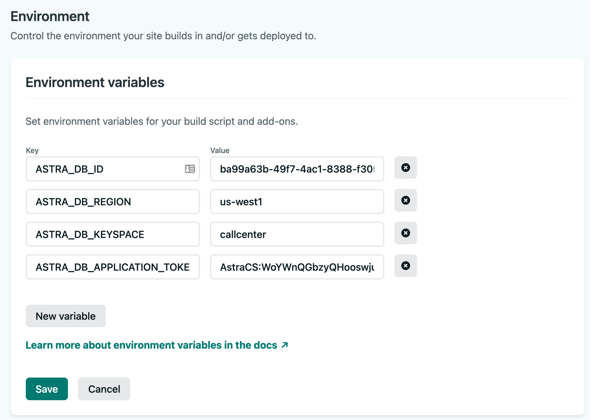

# Intro

This project simulates a call center web site where people leave a message for CSRs
to process later.  It uses Google's services, Netlify, and Astra Database.

## Using the app

The application is up and running at
[https://call-center-605a88.netlify.app/login](https://call-center-605a88.netlify.app/login)

The app works best on Chrome, and you need to give browser permissions for recording and location when prompted (for full effect).

Click login and use the following credentials:

- demo@datstax.com / demo

Press Start Recording and then start speaking, and press Stop Recording when finished.  Watch as your call is processed (it will take 1-2 mins).  Once you see status gcp-complete, you can click on the dashboard and click on the map to find your call and transcription.

Video demo located at: [https://youtu.be/33LgrD2yuLs](https://youtu.be/33LgrD2yuLs)

## High Level Architecture


### Web Server

The UI client is written in Angular and runs on netlify.  It a) calls an
API server to login the user, upload a recording, get a recording's
status, and present the dashboard, and b) has a **netlify function that
invokes Stargate's Document API** to get a specific user's recordings (at
the moment it is hard coded to all recordings).

Try it out - [https://call-center-605a88.netlify.app/login](https://call-center-605a88.netlify.app/login)

Login using either:

- demo@datastax.com / demo
- demo1@datastax.com /demo

After you are logged in, click on the ```Upload a File``` link at the top of
the page and you can record a voice message. Your browsermay prompt you to
give permission to use the microphone.

After you record your voice message clic on the ```Dashboard``` link at the
top of the page to see a map that shows where all of the messages came from.

### Microservices

All of the microservices run using Google Cloud Functions. There are only 2
microservices running:

- Login
- Files

You can find the code for these microservices in the ```api-server/google/```
folder.

#### uploadServer - Audio Processor (API Server)

The uploadServer is the API server that interacts with Astra (keep the Astra credentials a secret).
That is in **Node and uses the Node CQL** driver to make CQL queries.

This code accepts the file from the client, and moves it to GCP's Object Store (keep GCP credentials a secret), and logs the metadata into Astra.

## Installation

You will need the following components

1. Netlify account
1. This github repository
1. Astra DB in cloud provider / region of choice (our demo currently uses Google)
1. Credentials to a GCP service account, and a created cloud storage bucket.

Details on installation are in progress.

### Install nvm locally

```nvm``` is the Node Version Manager tool. The instructions for installing and using nvm are available at [https://github.com/nvm-sh/nvm#installing-and-updating](https://github.com/nvm-sh/nvm#installing-and-updating). You can use the commnd ```nvm ls-remote```to see all of the version of node that you can install. At the time of thi writing, the most recent version was 16.11.1 which I installed with the following command:

```sh
nvm install 16.11.1
```

### Create the Astra Database

1. Create your Astra database. In this example we named the database ```call_center``` and created a keyspace in it named ```callcenter```
1. Copy and paste the CREATE TABLE and CREATE CUSTOM INDEX commands from the ```database/data_model.cql``` file into the cqlsh of your Astra database.
1. In the Astra web UI, click on the down-arrow next to your organization name, and then click on ```Oraganization Settings``` in the dropdown menu. 
1. Create a custom role named ```call_center_admin``` and grant it all privileges, but restrict them to the call_center database.
 
1. Still in the settings for your organization, click on the ```Token Management``` link. 
1. Select the custom role you just created and press the ```Generate Token``` button. 
1. I suggest you download the CSV file that contains your token information. Keep it in a safeplace for future reference. 

### Configure Your Netlify Account

1. Clone a copy of the GitHub project at [GitHub](https://github.com/jdavies/call-center-app-v3)
1. ???? In the ```call-center-app-v3/netlify-client/``` copy the template_netlify.toml file and chnge the copies name to ```netify.toml``` ????
1. ???? Edit the ```netlify.toml``` file so the the last line contains the correct values for your Astra Database ID, the region it is in and also the Astra Database Token. ????
1. Create a GitHub project on your github account for the call-center-app-v3 project and check in all of the project's code. Netlify will need to use your github account.
1. Connect Netlify to your github ```call-center-app-v3``` project.
1. In the Environment settings for your application in Netlify, define environment variables. 
1. Next configure your build options in Netlify. [Build Settings](./images/netlify_build_settings.png)

### Configure Your Google Account

If you don't have a Google account already you can sign up for one for free at google.com.
